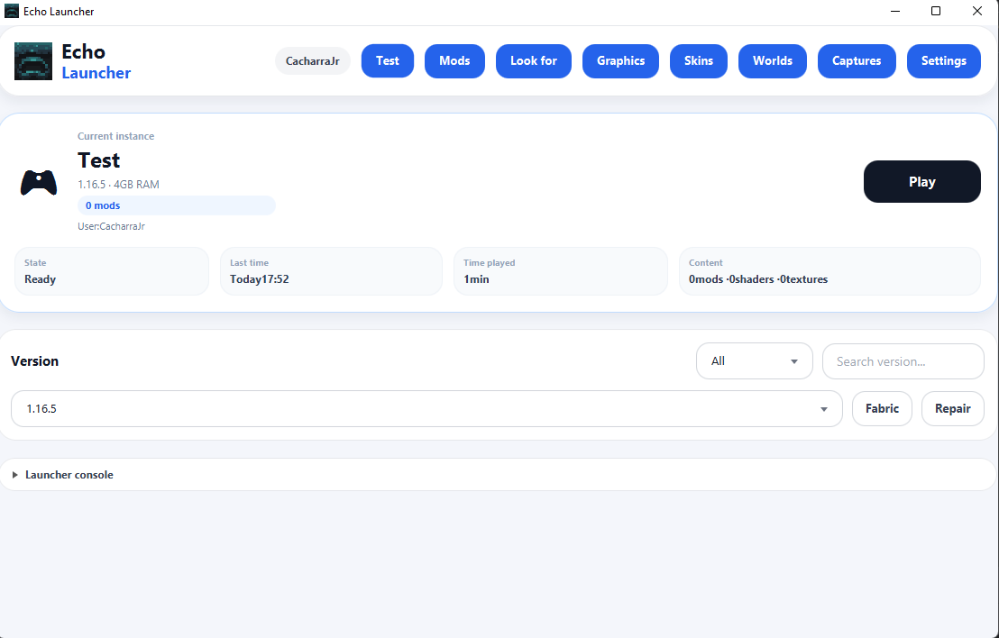

<div align="center">


# Echo Launcher

### A modern, instance-based Minecraft launcher inspired by Prism Launcher.

<p>
  <a href="https://github.com/GaudiestBaker74/Echo_Launcher/stargazers">
    
  </a>
  <a href="https://github.com/GaudiestBaker74/Echo_Launcher/graphs/contributors">
    
  </a>
  <a href="https://github.com/GaudiestBaker74/Echo_Launcher/releases">
    
  </a>
  <a href="https://github.com/GaudiestBaker74/Echo_Launcher/issues">
    
  </a>
</p>

<p>
  
  
  
  
</p>

</div>

---

<div align="center">

## Preview



</div>

> If the image does not appear, add a screenshot at `docs/screenshot.png` and a logo at `src/main/resources/icons/minecraft-launcher.png`.

---

## Overview

**Echo Launcher** is a custom Minecraft launcher built with **Java + JavaFX**.  
It focuses on a clean UI, instance-based management, Modrinth and CurseForge integration, custom Java runtimes, Fabric support, modpack importing, and useful tools for managing a modded Minecraft setup.

The project is inspired by launchers like **Prism Launcher**, while keeping a custom minimal dashboard interface.

---

## Features

### Modern Dashboard

- Clean premium-style home screen.
- Current instance overview.
- Play button with quick access controls.
- Minimal top navigation.
- Toast notifications for actions, warnings, and errors.
- Integrated collapsible console.

### Prism-like Instances

Each instance has its own isolated game folder:

```text
.minecraft-launcher/
└── instances/
    └── Example Instance/
        ├── instance.json
        └── minecraft/
            ├── mods/
            ├── resourcepacks/
            ├── shaderpacks/
            ├── config/
            ├── saves/
            ├── logs/
            └── screenshots/
```

Each instance can store:

- Minecraft version.
- Loader type.
- RAM allocation.
- Custom icon.
- Notes.
- Custom client `.jar`.
- JVM arguments.
- Mods, shaders, resource packs, saves, config, screenshots, and logs.

### Instance Templates

Echo Launcher supports template-based instance creation:

- Vanilla.
- Fabric Performance.
- Fabric Shaders.
- PvP 1.8.9.
- Custom empty instance.

Fabric templates can automatically install recommended mods such as Sodium, Iris, Fabric API, and other performance/visual mods.

### Custom Client JAR Support

Per-instance custom client `.jar` support is available.

Useful for:

- Custom 1.8.9 clients.
- Private client builds.
- Testing modified client jars.

The custom jar is stored inside the instance and placed first in the classpath.

### JVM Arguments Per Instance

Advanced users can configure custom JVM arguments per instance.

Example:

```text
-XX:+UseG1GC -XX:MaxGCPauseMillis=50 -Dfile.encoding=UTF-8
```

Memory arguments such as `-Xmx` and `-Xms` should be controlled by the RAM slider instead.

---

## Content Providers

###  Modrinth

Echo Launcher supports Modrinth for:

- Mods.
- Shaders.
- Resource packs.
- Modpacks.
- Popular content discovery.
- Project icons.
- Version selection before installing.
- Dependency installation.

###  CurseForge

Echo Launcher supports CurseForge through the official CurseForge API.

Supported features:

- Mods.
- Shaders.
- Resource packs.
- Modpacks.
- Project icons.
- Version selection before installing.
- Required dependency support.

> CurseForge requires an official API Key. It can be configured inside the launcher settings.

---

## Content Manager

The **Mods** section works as a unified content manager.

It supports:

- Mods.
- Shaders.
- Resource packs.

Available actions:

- Enable / disable.
- Delete.
- Open folder.
- View provider badge: Modrinth, CurseForge, or Local.
- View name, description, type, file size, and icon.

Disabled content is renamed automatically:

```text
mod.jar.disabled
shader.zip.disabled
resourcepack.zip.disabled
```

---

## Modpack Support

Echo Launcher can import modpacks as separate instances.

Supported formats:

- `.mrpack` from Modrinth.
- `.zip` from CurseForge.

Supported import methods:

- Drag and drop onto the launcher window.
- Import from the marketplace.
- Import from file.

When importing a modpack, the launcher creates a new instance automatically and downloads the required content.

---

## Fabric Support

Fabric installation is built in.

Features:

- Select Minecraft version.
- Choose Fabric Loader version manually.
- Install Fabric profile globally into Minecraft versions.
- Refresh version list automatically.

---

## Java Runtime Management

Echo Launcher can automatically download Java runtimes when Minecraft requires them.

Examples:

- Minecraft 1.8.x can use Java 8.
- Minecraft 1.18+ can use Java 17.
- Minecraft 1.20.5+ can use Java 21.
- Future versions can use newer runtimes such as Java 25.

Runtimes are stored in:

```text
.minecraft-launcher/runtimes/
```

The launcher itself can run with a different Java version than Minecraft.

---

## 3D Skin Viewer

A native JavaFX 3D skin viewer is included.

Features:

- 3D skin preview.
- Local skin `.png` support.
- Local cape `.png` support.
- Mouse rotation.
- Zoom with `Ctrl + mouse wheel`.
- Optional auto-rotation.
- Background selection.

---

## Pre-launch Checks

Before launching Minecraft, Echo Launcher can detect common problems:

- Duplicate mods.
- Missing Fabric API.
- Iris installed without Sodium.
- Shaders installed without Iris.
- Possible mod version mismatch.
- Disabled mods.

The launcher can show warnings before launch and offer automatic repairs for some issues.

---

## Crash Analyzer

If Minecraft exits with an error, the launcher analyzes the log and attempts to detect the cause.

It can identify:

- Java version mismatch.
- Missing dependencies.
- Duplicate mods.
- Mixin errors.
- Out-of-memory errors.
- OpenGL/graphics issues.
- Missing files.
- Network/download issues.

The crash dialog shows:

- Probable cause.
- Recommended solution.
- Technical details.
- Copy diagnostic option.

---

## World Manager

Per-instance world management is supported.

Features:

- View worlds.
- Open saves folder.
- Create world backups.
- Delete worlds.

Backups are stored inside the instance.

---

## Screenshot Manager

Per-instance screenshot manager is supported.

Features:

- View screenshots.
- Open screenshot folder.
- Open images with double click.
- Delete screenshots.

---

## Logs Per Instance

Each instance can store launcher/game related logs inside:

```text
instances/InstanceName/minecraft/logs/
```

This helps debugging individual instances separately.

---

## Supported Platforms

Echo Launcher is designed to support:

| Platform | Package Type |
|---|---|
| Windows | Portable `.zip` |
| Linux | `.AppImage` |
| macOS | `.app` inside `.zip` |

Builds are generated using GitHub Actions.

---

## Project Structure

```text
src/main/java/launcher/
├── Main.java
├── LauncherUI.java
├── MinecraftLauncher.java
├── VersionManager.java
├── VersionEntry.java
├── FabricManager.java
├── ModrinthClient.java
├── CurseForgeClient.java
├── ModpackManager.java
├── Profile.java
├── ProfileManager.java
├── Instance.java
├── InstanceManager.java
├── JavaRuntimeManager.java
├── PlatformManager.java
├── SkinViewer3D.java
├── CrashAnalyzer.java
└── PreLaunchChecker.java

src/main/resources/
├── style.css
└── icons/
    ├── minecraft-launcher.png
    ├── modrinth.png
    └── curseforge.png
```

---

## Requirements for Development

- Java 21+
- JavaFX
- Maven or Gradle
- Gson
- Internet connection for metadata and downloads

Recommended Maven dependencies:

```xml
<dependency>
    <groupId>org.openjfx</groupId>
    <artifactId>javafx-controls</artifactId>
    <version>21.0.2</version>
</dependency>

<dependency>
    <groupId>org.openjfx</groupId>
    <artifactId>javafx-web</artifactId>
    <version>21.0.2</version>
</dependency>

<dependency>
    <groupId>com.google.code.gson</groupId>
    <artifactId>gson</artifactId>
    <version>2.10.1</version>
</dependency>
```

---

## Build Artifacts

The GitHub Actions workflow can generate:

- `Minecraft_Launcher-linux-x86_64.AppImage`
- `Minecraft_Launcher-windows-x64.zip`
- `Minecraft_Launcher-macos-x64.zip`

---

## Roadmap

### Completed / In Progress

- [x] Prism-like instances.
- [x] Modrinth support.
- [x] CurseForge support.
- [x] Fabric installer.
- [x] Java runtime manager.
- [x] Mod manager.
- [x] Shader/resource pack manager.
- [x] Modpack importing.
- [x] Drag and drop modpack import.
- [x] Custom client jar support.
- [x] JVM args per instance.
- [x] Crash analyzer.
- [x] Pre-launch checker.
- [x] World manager.
- [x] Screenshot manager.
- [x] Multiplatform packaging.

### Future Improvements

- [ ] Real dark theme.
- [ ] Mod updater for Modrinth and CurseForge.
- [ ] Import CurseForge/Modrinth modpacks directly from URL.
- [ ] Microsoft authentication.
- [ ] Better dependency resolver.
- [ ] Per-instance Java selection.
- [ ] Instance icon image picker.
- [ ] Automatic duplicate mod fixer.
- [ ] Advanced backup/restore system.
- [ ] Installer packages: `.msi`, `.dmg`, `.deb`, `.rpm`.

---

## Notes

- CurseForge support requires a valid official API Key.
- Some files on CurseForge may not allow third-party downloads.
- Some Modrinth/CurseForge icons may be WebP/SVG; the launcher attempts to proxy or cache them as PNG.
- Minecraft assets, libraries, and versions are shared globally to reduce disk usage.
- Instance folders store mods, shaders, resource packs, saves, config, screenshots, and logs separately.

---

## APIs and Services

- Mojang/Piston Meta
- Fabric Meta API
- Modrinth API
- CurseForge API
- Eclipse Adoptium API

---

## License

Personal project / work in progress.

Add your preferred license here, for example MIT.
